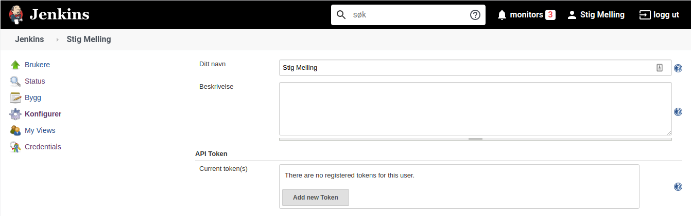

# jenkins-action
This action triggers an on-prem jenkins job using buildWithParameters

## Inputs

### `jenkinsUrl`

**Required** URL to Jenkinsserver.

### `username`

**Required** Username on JenkinsServer.

### `token`

**Required** Token attached to user in JenkinsServer.

### `job`

**Required** Name of job.

### `params`

JsonString with "name":"value" params. 
Sample: '{"paramName":"value"}'

## Outputs

### `time`

The time we greeted you.

## Example usage

```
uses: stigmellingjenkins-action@v1
with:
  jenkinsUrl: 'https://yourjenkinsserver.com'
  username: 'username'
  token: '123456....'
  job: 'name_of_job_in_jenkins'
  params: '{"paramName": "paramValue"}'
```

## Jenkins configuration
Add API-token to user profile. 

